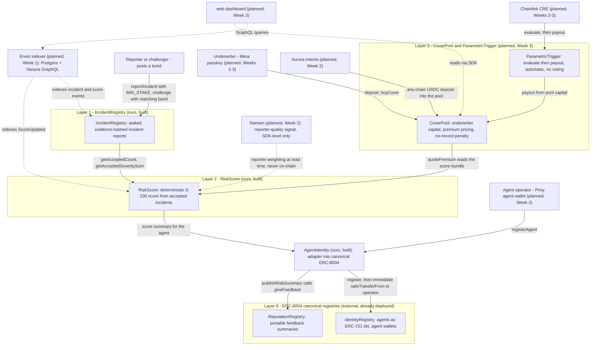

# Claimless — System Architecture

> Written against the repo as it exists on 2026-09-16 (Day 2 of 28). Built components are documented from the actual Solidity source; anything not yet written is labeled **planned (Week N)** per `PLAN.md` §2.

## 1. Overview

Claimless is an on-chain risk registry for ERC-8004 AI agents plus a parametric coverage prototype, built on Monad (testnet 10143 today, mainnet 143 in the same deployment recipe). The system has four layers: the **canonical ERC-8004 registries** (external, already deployed — we write into them, never fork them) give agents portable identity and reputation; **IncidentRegistry** (ours, built) records failure reports that cost a bond to produce and are hashed to off-chain evidence; **RiskScore** (ours, built) turns accepted incidents into a deterministic 0–100 public score with no oracle and no discretion; and **CoverPool + ParametricTrigger** (planned, Week 3) price coverage from that score and pay out automatically when a measurable trigger fires, with Chainlink CRE executing the evaluation. Indexing (Envio), reporter-quality weighting (Nansen), agent wallets (Privy), human passkeys (Mera), cross-chain deposits (Aurora Intents), and distribution (MetaMask Agent Wallet plugin, MCP server) attach at the edges and are planned for Weeks 1–3.

**Thesis:** measurable, not discretionary — agent risk becomes a public, re-computable number that anyone can verify, and payout is triggered by data, never by a human committee.

## 2. Layer diagram

Solid edges are on-chain calls; dotted edges are off-chain indexing or signals. Everything below Layer 0 that is not marked "planned" exists in `contracts/src/` today.



Attachment points, in one line each:

| Sponsor | Attaches at | Status |
|---|---|---|
| ERC-8004 | Layer 0: canonical registries written to via `AgentIdentity`, never forked | Built (adapter) / external (registries) |
| Envio | Indexes `IncidentRegistry` and `RiskScore` events into Postgres + Hasura GraphQL for the dashboard and SDK | **Working** (Week 1): self-hosted Docker stack indexes live Monad testnet events and serves them at `:8081/v1/graphql`. See `indexer/README.md` |
| Nansen | Reporter-quality weighting applied at SDK read time on top of the on-chain score; the on-chain formula stays deterministic | Planned (Week 2, `sdk/src/nansen.ts`) |
| Chainlink CRE | Calls `ParametricTrigger.evaluate` and executes payout; built with the free `cre workflow simulate` path | Planned (Weeks 2–3). `cre/` skeleton only |
| Privy | Autonomous agent wallets that report incidents without user interaction | Planned (Week 2, `sdk/src/privy.ts`) |
| Mera | Human underwriter passkey login for deposits and coverage purchase | Planned (Week 2, `sdk/src/mera.ts`) |
| Aurora Intents | Any-chain USDC deposits into `CoverPool`; demo uses a `dry: true` quote (zero cost), live swap needs ~$0.50 on Base | Planned (Week 2, `sdk/src/intents.ts`; wired into the UI Week 3) |
| MetaMask Agent Wallet plugin | Distribution: `mm claimless report/risk/agent` on Monad testnet 10143 | Planned (Week 3). `mm-plugin/` skeleton only |

## 3. Contract-by-contract reference

All signatures below are copied verbatim from the source files in `contracts/src/`. Shared types live in `contracts/src/interfaces/ClaimlessTypes.sol`: `Incident` (fields: `id`, `agentId`, `kind`, `severity`, `evidenceHash`, `reporter`, `stake`, `reportedAt`, `challengeDeadline`, `challenger`, `challengeStake`, `status`) and `IncidentStatus` (`PENDING`, `ACCEPTED`, `REJECTED`, `CHALLENGED`). Severity is `uint8`, 1 (minor) to 5 (catastrophic).

### 3.1 IncidentRegistry (`contracts/src/IncidentRegistry.sol`)

Staked, evidence-hashed incident reporting. This is the layer ERC-8004 is missing: a record that costs something to produce and cannot be silently skipped.

```solidity
constructor(address _resolver, uint256 _minStake)

function reportIncident(uint256 agentId, bytes32 kind, uint8 severity, bytes32 evidenceHash)
    external
    payable
    returns (uint256 incidentId);

function challenge(uint256 incidentId) external payable;

function resolveChallenge(uint256 incidentId, bool reportStands) external;

function finalize(uint256 incidentId) external;

function getIncidents(uint256 agentId) external view returns (Incident[] memory);
function getIncidentCount(uint256 agentId) external view returns (uint256);
function totalIncidents() external view returns (uint256);
function getIncident(uint256 incidentId) external view returns (Incident memory);
function getAcceptedCount(uint256 agentId) external view returns (uint256);
function getAcceptedSeveritySum(uint256 agentId) external view returns (uint256);
```

Immutable configuration: `address public immutable resolver`, `uint256 public immutable minStake`, `uint256 public constant CHALLENGE_WINDOW = 3 days`. There is also a `receive() external payable {}` recovery path.

**Dispute model (optimistic, UMA pattern):**

- A reporter must bond `minStake` (deployed as `0.01 ether`); a challenger must post a *matching* bond (`msg.value != inc.stake` reverts with `IncidentRegistry__StakeMismatch`).
- A fresh report is `PENDING` for `CHALLENGE_WINDOW` = 3 days (`reportedAt + 3 days` stored as `challengeDeadline`).
- **Optimistic:** if nobody challenges, the report stands. Anyone may call `finalize` after the window closes; the report becomes `ACCEPTED` and is tallied into the agent's score inputs. (Silence by the accused = the report stands.)
- If challenged, `resolveChallenge(incidentId, reportStands)` settles the duel: **the winner takes both bonds** (reporter's stake + challenger's challenge stake, paid to `inc.reporter` if `reportStands`, else to `inc.challenger`). Only an *accepted* outcome is tallied; a rejected report scores nothing for either side's target.
- `resolver = address(0)` makes resolution **permissionless**: `resolveChallenge` only checks `msg.sender` when `resolver != address(0)`. The deploy script uses `address(0)` on testnet for exactly this reason.
- Only `ACCEPTED` incidents enter the tallies (`_acceptedCount`, `_acceptedSeveritySum`), incremented inside `_tallyAgent` at accept time.

**Key invariants:**

- `severity` must be 1–5 (`IncidentRegistry__InvalidSeverity`), `msg.value >= minStake` (`IncidentRegistry__InsufficientStake`).
- Challenges only on `PENDING` incidents inside the window; resolution only on `CHALLENGED` ones; `finalize` only on `PENDING` incidents whose window has closed.
- A rejected/accepted outcome is terminal per incident; incident ids are the array index of a global append-only list.

**Events** (declared in `contracts/src/interfaces/IIncidentRegistry.sol`, emitted as in the source):

```solidity
event IncidentReported(
    uint256 indexed agentId,
    uint256 indexed incidentId,
    bytes32 kind,
    uint8 severity,
    address indexed reporter
);
event IncidentChallenged(uint256 indexed incidentId, address indexed challenger);
event IncidentFinalized(uint256 indexed incidentId, bool accepted);
event ChallengeResolved(uint256 indexed incidentId, bool reportStands, address winner);
```

### 3.2 RiskScore (`contracts/src/RiskScore.sol`)

Deterministic on-chain credit score derived purely from accepted incidents in `IncidentRegistry`. No oracle, no randomness — deliberate, so any party can re-run the formula and get the same number.

```solidity
constructor(address registry_)

function getScore(uint256 agentId) external view returns (uint256);
function recompute(uint256 agentId) external;
function getStoredScore(uint256 agentId) external view returns (uint256);
function hasScore(uint256 agentId) external view returns (bool);
function getScoreBundle(uint256 agentId)
    external
    view
    returns (uint256 score, uint256 acceptedCount, uint256 severitySum);
```

Constants: `uint256 public constant FREQ_WEIGHT = 5`, `uint256 public constant SEV_WEIGHT = 2`, `uint256 public constant MAX_SCORE = 100`. The immutable dependency is `IIncidentRegistry public immutable registry`.

**Exact formula (from the source):**

```
score = 100 - min(100, acceptedCount * 5 + severitySum * 2)
```

i.e. `penalty = acceptedCount * FREQ_WEIGHT + severitySum * SEV_WEIGHT`, capped at `MAX_SCORE` so the score floors at 0. Worked examples from the source comments: 0 accepted incidents → 100; 2 minor (severity 1) incidents → penalty 2×5 + 2×2 = 14 → score 86; 1 major (severity 3) → penalty 5 + 6 = 11 → score 89; 7 catastrophic (severity 5) → penalty 35 + 70 = 105 → capped, score 0.

Implementation detail worth knowing: `_penaltyToScore` short-circuits to 0 when either input alone would saturate the cap (`acceptedCount > 20` or `severitySum > 50`), which also keeps the multiplication overflow-safe for any `uint256`.

**Key invariants:**

- Score is a pure function of `registry.getAcceptedCount(agentId)` and `registry.getAcceptedSeveritySum(agentId)`; `recompute` is the only writer of `_storedScores` and always emits `ScoreUpdated` (first call emits the implicit old score of 0).
- `getScore` always reflects live registry state; `getStoredScore` reflects the last `recompute`.
- `getScoreBundle` returns the live score plus the raw inputs, sized for `CoverPool.quotePremium` (planned, Week 3) and UIs.

**Events:**

```solidity
event ScoreUpdated(uint256 indexed agentId, uint256 oldScore, uint256 newScore);
```

### 3.3 AgentIdentity (`contracts/src/AgentIdentity.sol`)

Adapter into the **canonical** ERC-8004 registries. Claimless does not fork ERC-8004: agents are registered in the upstream `IdentityRegistry` and risk summaries are pushed into the upstream `ReputationRegistry` via `giveFeedback` under a fixed taxonomy tag so external consumers can filter them. Registry addresses are constructor args, so the same recipe works on Monad testnet (10143) and mainnet (143); nothing is hardcoded.

```solidity
constructor(IIdentityRegistry identityRegistry_, IReputationRegistry reputationRegistry_)

function registerAgent(string calldata agentURI) external returns (uint256 agentId);
function ownerOfAgent(uint256 agentId) external view returns (address);

function publishRiskSummary(
    uint256 agentId,
    int128 score,
    uint8 decimals,
    string calldata tag1,
    string calldata tag2
) external onlyOwner;

function getAgentRisk(uint256 agentId, string calldata tag1, string calldata tag2)
    external
    view
    returns (uint64 count, int128 summaryValue, uint8 summaryValueDecimals);
function getAgentRisk(uint256 agentId)
    external
    view
    returns (uint64 count, int128 summaryValue, uint8 summaryValueDecimals);
function getAgentOwner(uint256 agentId) external view returns (address);
function getAgentWallet(uint256 agentId) external view returns (address);
function clients() external view returns (address[] memory);
function setClients(address[] calldata newClients) external onlyOwner;
function transferOwnership(address newOwner) external onlyOwner;
```

Public state also exposed: `mapping(address owner => uint256 agentId) public agentOf;` and `string public constant TAG1_INCIDENT = "claimless:incident";`. The `_clients` list (used by `ReputationRegistry.getSummary`, which requires a non-empty array) defaults to `[address(this)]` and is owner-replaceable via `setClients`.

**Key design point — the NFT is transferred immediately.** `registerAgent` calls `identityRegistry.register(agentURI)`, which mints the agent NFT to `msg.sender` — and inside this call, that is the adapter. The very next line is `identityRegistry.safeTransferFrom(address(this), msg.sender, agentId)`, handing the identity to the calling operator. The adapter owns the NFT only between these two calls. Two reasons, from the source:

1. The human owns their identity.
2. **ERC-8004 blocks self-feedback.** An adapter that kept ownership would be the NFT's own recorded client, so `publishRiskSummary` could never publish a risk summary for an agent it registered — the canonical registry would revert downstream. Transferring ownership out makes the summary path work. `publishRiskSummary` still guards early: if `identityRegistry.ownerOf(agentId) == address(this)` it reverts with `NotAgentOwner`.

Other design rules enforced in code:

- `publishRiskSummary` is owner-only: this adapter is the trusted underwriter feed (`IncidentRegistry` → `RiskScore` → here). It pushes a **summary, not raw events**; rich data stays in `IncidentRegistry`.
- `tag1` should stay `TAG1_INCIDENT` (`"claimless:incident"`) for comparability; `tag2` is free-form (e.g. `"SLA_BREACH"`).
- Interfaces (`IIdentityRegistry`, `IReputationRegistry`) are hand-written in `contracts/src/interfaces/` from the official upstream ABIs saved in `contracts/abis/` — including the corrected `getSummary` return of `uint64 count`.

**Events:**

```solidity
event AgentRegistered(uint256 indexed agentId, address indexed owner, string agentURI);
event SummaryPublished(uint256 indexed agentId, int128 score, uint8 decimals, string tag1);
event ClientsUpdated(address[] clients);
event OwnershipTransferred(address indexed previousOwner, address indexed newOwner);
```

### 3.4 CoverPool and ParametricTrigger — planned (Week 3)

Not yet written; specified in `PLAN.md` §3. `CoverPool` holds underwriter capital (`deposit`, `withdraw`), quotes premiums from `RiskScore` (`quotePremium`), and sells coverage (`buyCover`) with the cold-start constants `NO_RECORD_PREMIUM_MULTIPLIER = 5` and `NO_RECORD_MAX_COVERAGE_BPS = 1000` (10% of the normal cap). `ParametricTrigger` registers a measurable condition per coverage and executes `payout` automatically — `payout` must never require human approval, voting, or a committee. `RiskScore.getScoreBundle` is sized as its pricing input, and Chainlink CRE (planned, Weeks 2–3) is the intended caller of `evaluate`.

## 4. Data flow (end-to-end)

1. **Agent registers.** The operator (Privy agent wallet, planned Week 2) calls `AgentIdentity.registerAgent(agentURI)`. The canonical ERC-8004 `IdentityRegistry` mints the agent NFT to the adapter, which immediately `safeTransferFrom`s it to the operator (see §3.3) and records `_agentOwner` / `agentOf`.
2. **An incident is reported.** A reporter — the harmed client, the agent itself, or any observer — calls `IncidentRegistry.reportIncident(agentId, kind, severity, evidenceHash)` with at least `minStake` (0.01 ether at deploy). `kind` is a taxonomy hash (e.g. `keccak256("SLA_BREACH")`), `evidenceHash` is `keccak256(input||output)` with the payload off-chain. Status: `PENDING`, `IncidentReported` emitted.
3. **The report is adjudicated optimistically.** If nobody posts a matching bond within 3 days, anyone calls `finalize(incidentId)` and the report is `ACCEPTED` (silence = the report stands). If challenged, `resolveChallenge(incidentId, reportStands)` awards both bonds to the winner (permissionless when `resolver = address(0)`), and only `reportStands == true` tallies the incident. Accepted incidents increment `_acceptedCount` and `_acceptedSeveritySum` for the agent.
4. **Score recomputes.** Anyone calls `RiskScore.recompute(agentId)`: `score = 100 - min(100, acceptedCount*5 + severitySum*2)`, persisted and emitted as `ScoreUpdated`. `getScore` also serves the live value without a write.
5. **Summary published to ERC-8004.** The adapter owner calls `AgentIdentity.publishRiskSummary(agentId, score, decimals, TAG1_INCIDENT, tag2)`, which forwards to `ReputationRegistry.giveFeedback` under the `"claimless:incident"` tag. The risk signal is now portable: any ERC-8004 consumer can read it with `getSummary` / `AgentIdentity.getAgentRisk(agentId)`.
6. **Underwriter prices coverage.** An underwriter (Mera passkey, planned Weeks 2–3) deposits capital into `CoverPool` (planned Week 3; possibly funded from any chain via an Aurora Intents deposit) and buys coverage for the agent. `quotePremium` derives the premium from the `RiskScore` score bundle; an agent with no record at all is *not* rejected — it is quoted a punitive premium (5×) and a hard-capped small coverage (10% of the normal cap). See §5.
7. **Trigger fires → payout.** `ParametricTrigger` (planned Week 3) holds a measurable condition per coverage (narrow and deterministic: latency, HTTP status, completion rate). Chainlink CRE (planned Weeks 2–3) calls `evaluate(coverageId)`; when the condition is met, `payout(coverageId)` executes automatically from pool capital. No voting, no committee, no human adjudication.
8. **Everything is observable.** Envio (planned Week 1) indexes the incident and score events into GraphQL; the dashboard (planned Week 3) reads agent lists, scores, and coverage live.

## 5. Incentive design summary

The design separates two problems that look similar and are not: making **false reports** expensive, and making **silence** expensive.

- **Staking is only for disputes.** The `MIN_STAKE` bond on `reportIncident` and the matching challenger bond exist so that a *false* report can be punished by a duel the liar loses (winner takes both bonds). Staking makes lying expensive; it does nothing about silence — and silence is the measured problem (see below).
- **Silence is priced, never hard-rejected.** This is the primary mechanism and it lives in `CoverPool.quotePremium` / `buyCover` (planned, Week 3). The decided policy (2026-09-15, `docs/INCENTIVE_MECHANISM_DESIGN.md` §4.1): an agent with **no record at all can still buy coverage**, but at a **punitive premium** (`NO_RECORD_PREMIUM_MULTIPLIER = 5`, i.e. 5× the best tier) and a **hard-capped small coverage** (`NO_RECORD_MAX_COVERAGE_BPS = 1000`, 10% of the normal cap). `CoverRefused` is reserved for genuinely invalid cases (unknown agent, insolvent pool), never for missing data. In one line: *"we don't pay people to confess and we don't punish them for silence; we just price the silence."*
- **Why this beats a hard rejection:** the cold start. ERC-8004 is the controlled experiment — **827,827 agents registered, essentially zero feedback** (`docs/ERC8004_COLDSTART_FINDINGS.md`, ~8,278 registrations per feedback entry; 1,821 agents on Monad testnet with only demo artifacts carrying feedback). Free, optional, unpunished reporting collects nothing. A hard rejection would give a brand-new agent *no reason to ever come back*: it has no data, so it is refused, so it never creates data. Allowing small, expensive coverage creates a first purchase, which creates the record, which unlocks better terms — the conversion loop. It also creates the visible before/after for the demo (worse quote → report → better quote), and it keeps the asymmetry we want: **a disclosed bad record is still better than no record**, which is exactly the incentive for honesty. Proven pattern: Sherlock Shield prices coverage by disclosed findings ($500k at zero findings down to $1k at 30+); traditional insurance treats disclosure as a condition, with non-disclosure causing denial or rescission — neither pays for honesty, both price concealment.

## 6. Explicit non-goals

- ❌ **No ZK / zkML.** Unnecessary: our triggers and score are deterministic, not semantic. Anything that can be recomputed does not need to be proven.
- ❌ **No claim voting.** Discretionary claim adjudication is the documented root cause of death for InsurAce, Cover Protocol, and Nexus Mutual V1/V2.
- ❌ **No committee.** Nexus Mutual's end state is three human experts; we build the system where there is nothing for a human to decide.
- ❌ **Never called "insurance".** Regulation risk is high; the product is always described as a "risk registry + coverage prototype".
- Also, from `docs/INCENTIVE_MECHANISM_DESIGN.md` §4.3: no reward for reporting (invites fabrication, we cannot fund it), no token, and no slashing of reporters for non-disclosure (a worse price is enough).

## 7. Deployed addresses

### ERC-8004 canonical registries (external, verified on-chain — we write into them, never fork them)

| Network | IdentityRegistry | ReputationRegistry |
|---|---|---|
| Monad testnet (10143) | `0x8004A818BFB912233c491871b3d84c89A494BD9e` | `0x8004B663056A597Dffe9eCcC1965A193B7388713` |
| Monad mainnet (143) | `0x8004A169FB4a3325136EB29fA0ceB6D2e539a432` | `0x8004BAa17C55a88189AE136b182e5fdA19dE9b63` |

### Claimless contracts

`script/Deploy.s.sol` (targets Monad testnet, asserts `block.chainid == 10143`, verifies the canonical registries have code, then deploys `IncidentRegistry(address(0), 0.01 ether)`, `RiskScore(registry)`, and `AgentIdentity(identity, reputation)`) **writes the resulting addresses to `contracts/deployments/monad-testnet.json`** — along with the chain id, network, deployer, the ERC-8004 pair, and resource links (RPC `https://testnet-rpc.monad.xyz`, gas faucet `https://faucet.monad.xyz`, Circle testnet USDC `0x534b2f3A21130d7a60830c2Df862319e593943A3` via `https://faucet.circle.com`).

Current state of that file: the ERC-8004 addresses are filled in; the Claimless contract entries (`incidentRegistry`, `riskScore`, `agentIdentity`) are still `null` with `"status": "PENDING — filled by script/Deploy.s.sol after broadcast"`. There are no Claimless contract addresses to list yet; this table should be updated from the JSON after the first broadcast.

| Contract | Address |
|---|---|
| IncidentRegistry | pending first deploy (written to `contracts/deployments/monad-testnet.json`) |
| RiskScore | pending first deploy (same file) |
| AgentIdentity | pending first deploy (same file) |

### Repo build status

| Directory | State |
|---|---|
| `contracts/` | Built: `IncidentRegistry`, `RiskScore`, `AgentIdentity`, interfaces + tests + deploy script |
| `indexer/` | Directory scaffolded, empty — Envio indexer planned (Week 1) |
| `sdk/`, `web/`, `mcp/`, `mm-plugin/`, `agents/`, `cre/`, `integrations/langchain/` | Skeleton only — planned (Weeks 2–3) |